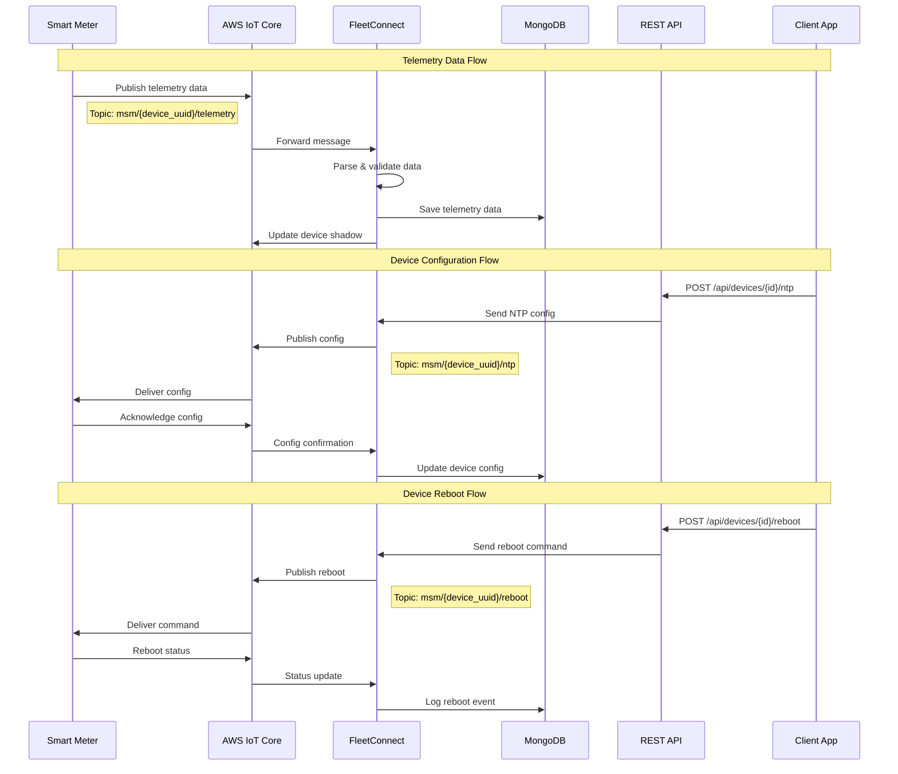
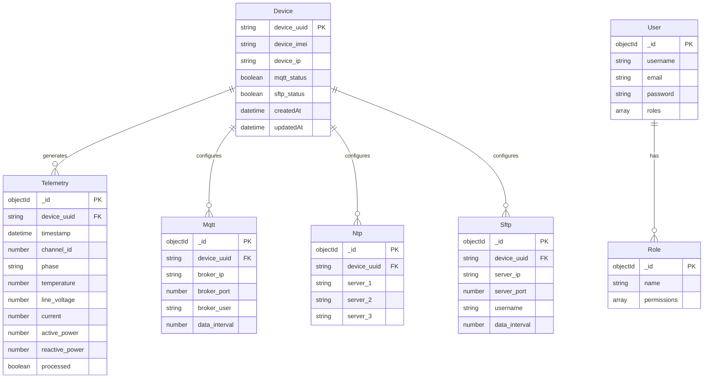

# MSM (Meter State Management) - System Flow Diagram

## 🏗️ System Architecture Overview

```mermaid
---
flowchart TB
 subgraph IoT["IoT Devices"]
        D1["Smart Meter ESP90000005"]
        D1C["MQTT Client"]
  end
 subgraph AWS["AWS IoT Core"]
        CERT["Provisioning & Cert Service"]
        THING["Thing Creation"]
        IOT["MQTT Broker"]
        SHADOW["Device Shadow"]
  end
 subgraph Backend["MSM Backend System"]
        FC["FleetConnect.js<br>MQTT Client"]
        SERVER["Express Server<br>server.js"]
        API["APIs"]
        DB[("MongoDB")]
  end
 subgraph Clients["Clients"]
        WEB["Web Dashboard"]
        MOBILE["Mobile App"]
  end

 %% Device Provisioning
 D1 --> D1C
 D1C -. Claim Certs .-> CERT
 CERT -- New Certs --> D1C
 CERT --> THING

 %% Data Flow
 D1C -- Auth + Telemetry --> IOT
 IOT --> SHADOW
 SHADOW <-- Sync --> D1C

 %% Backend
 IOT <-- MQTT Topics --> FC
 SHADOW <-- Shadow Updates --> FC
 FC --> SERVER
 SERVER --> API
 API --> DB

 %% Client Interaction
 WEB -- Command Request --> SERVER
 MOBILE -- Command Request --> SERVER
 SERVER -- Commands --> FC
 FC -- Publish Command --> IOT
 IOT -- Command Delivery --> D1C


```

## 📊 Data Flow Diagram



## 🔄 MQTT Topics & Message Flow

```mermaid
graph LR
    subgraph "Device → Cloud Topics"
        T1[msm/+/telemetry<br/>High-frequency data]
        T2[msm/+/device_info<br/>Device information]
        T3[msm/+/reboot<br/>Reboot status]
        T4[msm/+/ntp<br/>NTP confirmations]
        T5[msm/+/mqtt<br/>MQTT confirmations]
        T6[msm/+/sftp<br/>SFTP confirmations]
    end
    
    subgraph "Cloud → Device Topics"
        C1[msm/{uuid}/reboot<br/>Reboot commands]
        C2[msm/{uuid}/ntp<br/>NTP config]
        C3[msm/{uuid}/mqtt<br/>MQTT config]
        C4[msm/{uuid}/sftp<br/>SFTP config]
    end
    
    subgraph "AWS Device Shadow"
        S1[$aws/things/+/shadow/update<br/>State synchronization]
    end
    
    FC[FleetConnect MQTT Client]
    
    T1 --> FC
    T2 --> FC
    T3 --> FC
    T4 --> FC
    T5 --> FC
    T6 --> FC
    
    FC --> C1
    FC --> C2
    FC --> C3
    FC --> C4
    
    FC <--> S1
```

## 🗄️ Database Schema Relationships



## 🚀 API Endpoints Overview

### Authentication & Authorization
- `POST /api/auth/login` - User authentication
- `POST /api/auth/register` - User registration
- `GET /api/role` - Role management

### Device Management
- `POST /api/devices/{id}/reboot` - Send reboot command
- `POST /api/devices/{id}/ntp` - Configure NTP servers
- `POST /api/devices/{id}/mqtt` - Configure MQTT settings
- `POST /api/devices/{id}/sftp` - Configure SFTP settings
- `GET /api/devices/{id}/status` - Get device status

### Data Retrieval
- `GET /api/telemetry` - Retrieve telemetry data
- `GET /api/mqtt` - Get MQTT configurations
- `GET /api/ntp` - Get NTP configurations
- `GET /api/sftp` - Get SFTP configurations

## 🔐 Security & Authentication

```mermaid
graph TB
    subgraph "Device Authentication"
        CERT[X.509 Certificates]
        PRIV[Private Keys]
        CA[Amazon Root CA]
    end
    
    subgraph "API Authentication"
        JWT[JWT Tokens]
        BCRYPT[Password Hashing]
        ROLES[Role-based Access]
    end
    
    subgraph "Communication Security"
        MQTTS[MQTTS (Port 8883)]
        HTTPS[HTTPS REST API]
        TLS[TLS Encryption]
    end
    
    CERT --> MQTTS
    PRIV --> MQTTS
    CA --> MQTTS
    
    JWT --> HTTPS
    BCRYPT --> HTTPS
    ROLES --> HTTPS
    
    MQTTS --> TLS
    HTTPS --> TLS
```

## 📈 System Components Interaction

1. **Device Layer**: Smart meters with ESP32/similar microcontrollers
2. **Communication Layer**: AWS IoT Core MQTT broker with certificate-based authentication
3. **Application Layer**: Node.js backend with FleetConnect MQTT client
4. **API Layer**: Express.js REST API with authentication middleware
5. **Data Layer**: MongoDB for persistent storage
6. **Client Layer**: Web/mobile applications consuming REST APIs

## 🔄 Key Processes

### Telemetry Collection Process
1. Device measures electrical parameters (voltage, current, power, energy)
2. Data published to `msm/{device_uuid}/telemetry` topic
3. FleetConnect receives and parses telemetry data
4. Data stored in MongoDB Telemetry collection
5. Device shadow updated with latest state

### Device Configuration Process
1. Admin sends configuration via REST API
2. FleetConnect publishes config to device-specific topic
3. Device receives and applies configuration
4. Device sends confirmation back
5. Configuration status updated in database

### Real-time Monitoring
1. Device shadow maintains current device state
2. FleetConnect tracks connected devices
3. API provides real-time device status
4. Clients can monitor device health and connectivity

This architecture enables scalable IoT device management with real-time data collection, remote configuration, and comprehensive monitoring capabilities.
